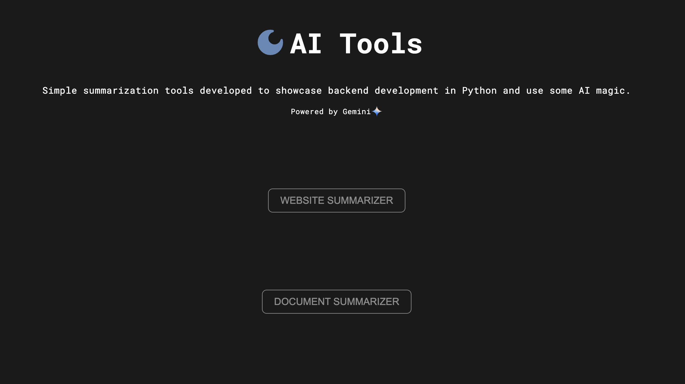
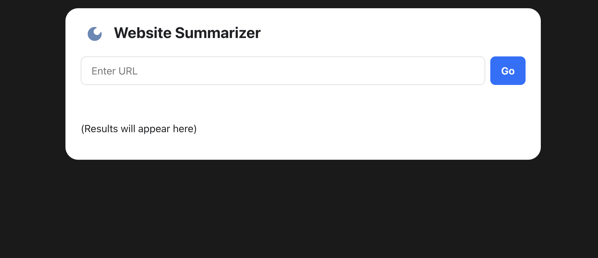
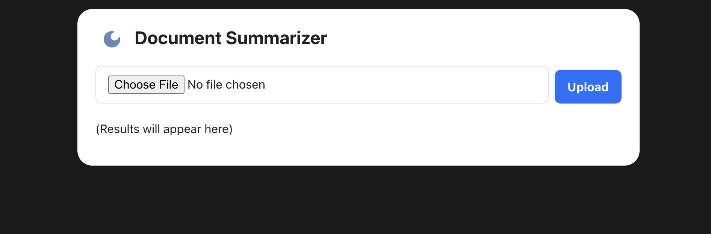

# Python AI Tools

## Installation

There are a few dependencies that need to be installed before running the application. To install them, run the following command:

```sh
pip install -r requirements.txt
```

## Usage

To start the application, run the following command:

```sh
python app.py
```

The deployment version of the application is set to run on port 5000 on host 0.0.0.0.

To run the application in a development environment, the `app.run()` command should be updated to the following in the [app.py](./app.py) file:

```py
app.run(port=5510, debug=True)
```

## Examples

Each time a request is made to the backend server with valid information, the server will respond with a JSON object containing the results of the request. In the case of this project the request will include either a string of the URL, or the file that need summarization. The data is then streamed from the Gemini API and the results are streamed back to the client.

### Path: `/`



### Path: `/site`



### Path: `/doc`



## Contact

If you want to contact me you can reach me at [eglenn.dev/contact](https://eglenn.dev/contact)
